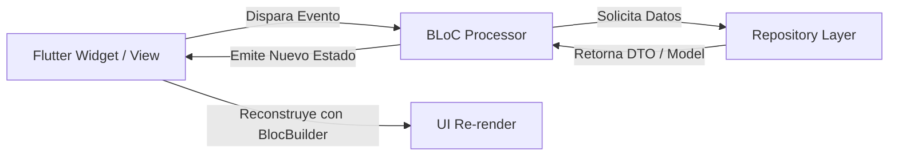

# 🧱 Flutter BLoC Patterns Agent Skill

> **Habilidad Especializada en Arquitectura BLoC, Gestión de Estado Reactivo y Patrones Avanzados para proyectos Flutter**.

Diseñado para expandir, refactorizar y estandarizar la capa de presentación y estado en aplicaciones Flutter utilizando `flutter_bloc`, `cubit`, `hydrated_bloc` y `bloc_test`.

---

## 📌 Propósito y Alcance

`flutter-bloc-patterns-agent-skill` dota a los agentes de IA de patrones reactivos de nivel producción para Flutter:

1. **🏛️ Arquitectura Reactiva Unidireccional**: Separación estricta entre UI, BloC/Cubit, Repositorios y Data Sources.
2. **🧊 Diseño de Estados Inmutables**: Jerarquías de estado selladas (`sealed class`, `freezed`, `equatable`) con manejo preventivo de estados `Initial`, `Loading`, `Success` y `Failure`.
3. **💾 Persistencia de Estado (`HydratedBloc`)**: Almacenamiento local automático de estados BLoC entre reinicios de la aplicación sin boilerplate manual.
4. **🧪 Pruebas Unitarias de BLoC (`bloc_test`)**: Cobertura del 100% de transiciones de estado, emisión de eventos y pruebas deterministas con mocks.
5. **⚡ Optimización de Rendimiento**: Uso estratégico de `buildWhen`, `listenWhen`, `BlocSelector` y prevención estricta de memory leaks.

---

## ⚡ $-Comandos de BLoC

| Comando | Acción | Descripción |
|---|---|---|
| `$bloc` | **Bootstrap BLoC** | Activa la habilidad de BLoC y analiza la arquitectura de estado actual. |
| `$bloc:create [nombre]` | **Generador** | Genera un conjunto completo de BLoC (Event, State, Bloc, Repository). |
| `$bloc:cubit [nombre]` | **Generador Cubit** | Genera un Cubit ligero para flujos síncronos o simples. |
| `$bloc:hydrated [nombre]` | **Persistencia** | Convierte o genera un HydratedBloc con serialización/deserialización JSON. |
| `$bloc:audit` | **Auditoría de Memoria** | Detecta cierres faltantes de streams, rebuilds innecesarios y acoplamientos de UI. |
| `$bloc:test [nombre]` | **Generador de Test** | Genera suite de pruebas unitarias usando `blocTest()` y `mocktail`. |

---

## 🧩 Flujo Unidireccional de BLoC



---

## 📦 Instalación como Submódulo

```bash
git submodule add https://github.com/xolotl-hub/flutter-bloc-patterns-agent-skill.git .agents/skills/flutter-bloc
```

Para activar en la sesión actual:
```text
$bloc
```
