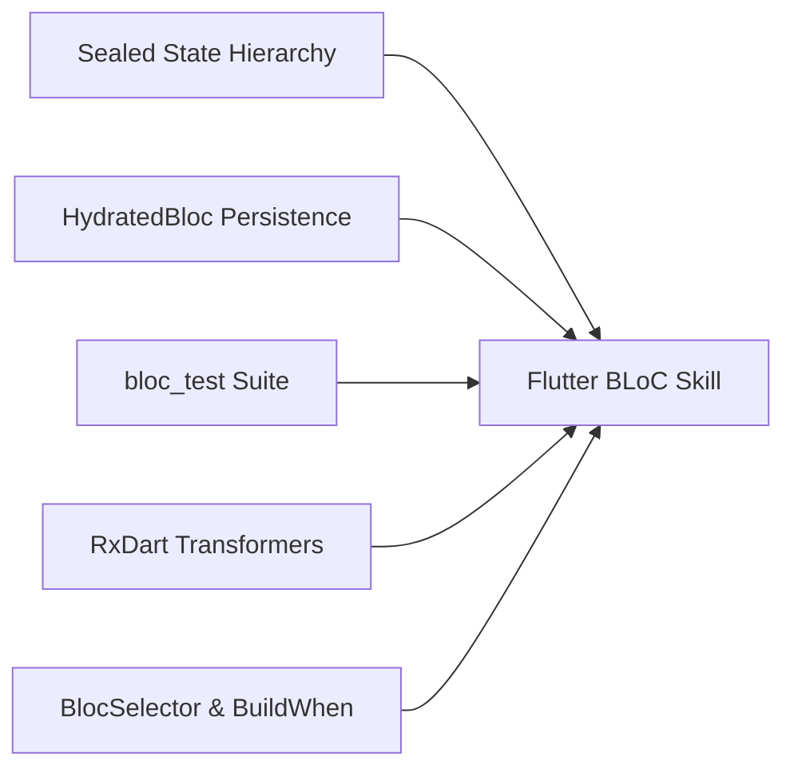

# ⚙️ Flutter BLoC Patterns Skill Matrix & Directives

## 🎯 Capacidades de la Habilidad



---

## 📋 Protocolo de Auditoría BLoC (`$bloc:audit`)

1. **Auditoría de Widgets**:
   - ¿Se usan `BlocBuilder` masivos en la raíz del arbol de widgets? Sugerir extracción a sub-widgets más pequeños o `BlocSelector`.
   - ¿Se usa `BlocListener` para efectos secundarios (SnackBars, Navegación, Diálogos) en lugar de intentar meterlos en la función de build?
2. **Auditoría de BLoC**:
   - ¿Se instancian Repositorios dentro del BLoC en lugar de inyectarse por constructor?
   - ¿Los eventos tienen handlers debounced / throttled cuando aplican (ej. búsquedas autocomplete con `restartable()` o `debounce()`)?
3. **Auditoría de Pruebas**:
   - ¿Cada evento del BLoC posee al menos un `blocTest` que valida la transición exacta de estados?

---

## 🏗️ Estructura Canónica de Estado Sellado (Dart 3 Sealed Classes)

```dart
import 'package:equatable/equatable.dart';

sealed class FeatureState extends Equatable {
  const FeatureState();

  @override
  List<Object?> get props => [];
}

final class FeatureInitial extends FeatureState {}

final class FeatureLoading extends FeatureState {}

final class FeatureSuccess extends FeatureState {
  final List<DataModel> items;
  const FeatureSuccess(this.items);

  @override
  List<Object?> get props => [items];
}

final class FeatureFailure extends FeatureState {
  final String errorMessage;
  const FeatureFailure(this.errorMessage);

  @override
  List<Object?> get props => [errorMessage];
}
```


---

## 📝 Persistencia y Salida Activa (`overview/work/skill/`)

Al ejecutar esta skill (mediante `$bloc` o `$bloc:audit`), es **obligatorio crear o actualizar su reporte activo** dentro del proyecto cliente en la ruta:

`overview/work/skill/flutter-bloc-patterns.md`

### Estructura Requerida del Reporte:

```markdown
# 📋 Registro Activo de Tareas — Flutter BLoC Patterns Agent Skill

> **Generado por**: `flutter-bloc-patterns-agent-skill` (`$bloc:audit`)  
> **Última actualización**: YYYY-MM-DD  

## 🎯 Tareas Pendientes Accionables

| ID | Tipo | Estado | Resumen | Evidencia/Ruta | Acción Requerida |
|---|---|---|---|---|---|
| BLOC-01 | Fix / Refactor | Pendiente | <Resumen breve> | `<ruta:línea>` | <Remediación recomendada> |

## 📝 Observaciones y Detalles de Revisión
- Detalle técnico, evidencia o contexto extendido proporcionado por la revisión de la skill.
```
